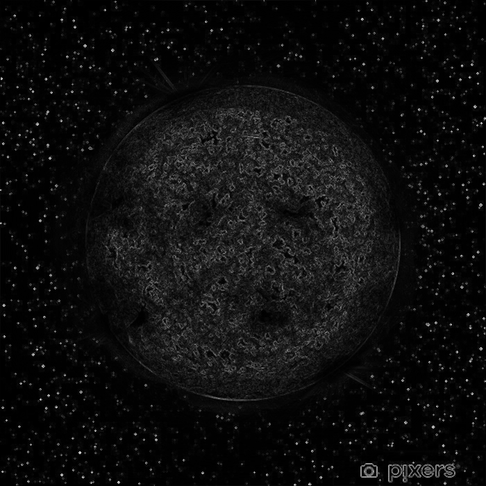

# Practical introduction of numerical analysis applied on images

Small university project proposed in the subject "Numerical Analysis" in the 1st year of MSc of Computer Science in Imaging & Machine Learning at the University of Caen Normandy in order to to implement some mathematical equations on 2-dimensionnal images seen in this course.

## Table of contents

  - [Table of contents](#table-of-contents)
  - [Introduction](#introduction)
  - [Setup](#setup)
  - [Commands](#commands)
  - [Results](#results)
  - [Authors](#authors)
  - [License](#license)

## Introduction

The goal of the project is to implement some mathematical equations on 2-dimensionnal images :

- the dilation equation :

<p align="center">
    
</p>

- the erosion equation :

<p align="center">
    
</p>

## Setup

You need to have Python 3 installed on your machine.
You can install the dependences with one of this two commands :
```sh
# if you already have installed virtual environment
$ pipenv install
$ pipenv shell
```
or
```sh
$ pip3 install -r requirements.txt
```

## Commands
To launch the script, you only have to execute this command :
```sh
$ python3 script.py
```

## Results
From this image :
<p align="center">
    
</p>
- if you dilate the image :
<p align="center">
    
</p>
- if you erode the image :
<p align="center">
    
</p>

## Authors
- [LETELLIER Guillaume](https://github.com/Guigui14460)

## License
Project under the MIT license.